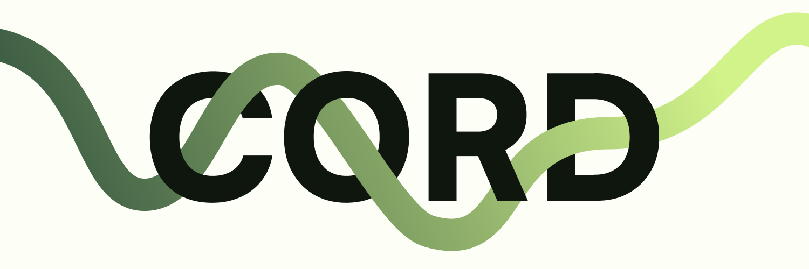

Cord is a string based language for structured sentences that enables low-code data input while maintaining precise control over input definitions, options, and associated values. It allows developers to define user-facing interfaces for data entry that map to specific intents.

## Core Concepts

### Input Placeholders

Input placeholders are denoted by curly braces containing an index number, starting from 0:

```txt
{0}, {1}, {2}, etc.
```

## Usage Patterns

### Raw Substitution

For independent inputs that don't share data relationships, use simple indexed placeholders:

```txt
Deposit {0} {1} into {2}.
```

### Naming

When the inputs are returned an array with name mappings can be created for simple API relaying:

```txt
Transfer {0<amount>} {1<token>} {2<id>} to {3<recipient>}.
```

### Typing

To provide the best user experience you can define a single-depth `EVM` type to enable native validation.

```txt
Transfer {0<amount:uint256>} {1<token:address>} {2<id:uint256>} to {3<recipient:address>}.
```
